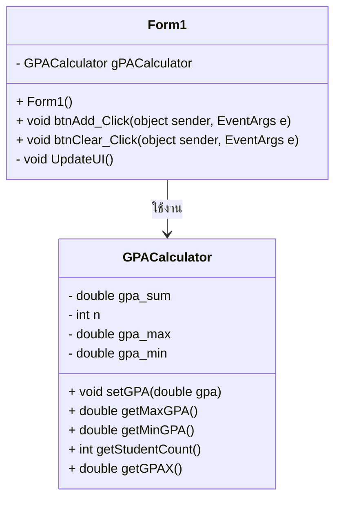

# GPA Calculator

## Overview

โปรแกรม GPA Calculator ใช้สำหรับคำนวณค่าเฉลี่ย GPA, ค่าต่ำสุด, ค่าสูงสุด และจำนวนข้อมูลที่รับเข้ามา โดยใช้ C# Windows Forms

## Class Diagram

```mermaid
classDiagram
    class Form1 {
        - GPACalculator gPACalculator
        + Form1()
        + void btnAdd_Click(object sender, EventArgs e)
        + void btnClear_Click(object sender, EventArgs e)
        - void UpdateUI()
    }

    class GPACalculator {
        - double gpa_sum
        - int n
        - double gpa_max
        - double gpa_min
        + void setGPA(double gpa)
        + double getMaxGPA()
        + double getMinGPA()
        + int getStudentCount()
        + double getGPAX()
    }

    Form1 --> GPACalculator : ใช้งาน
```
